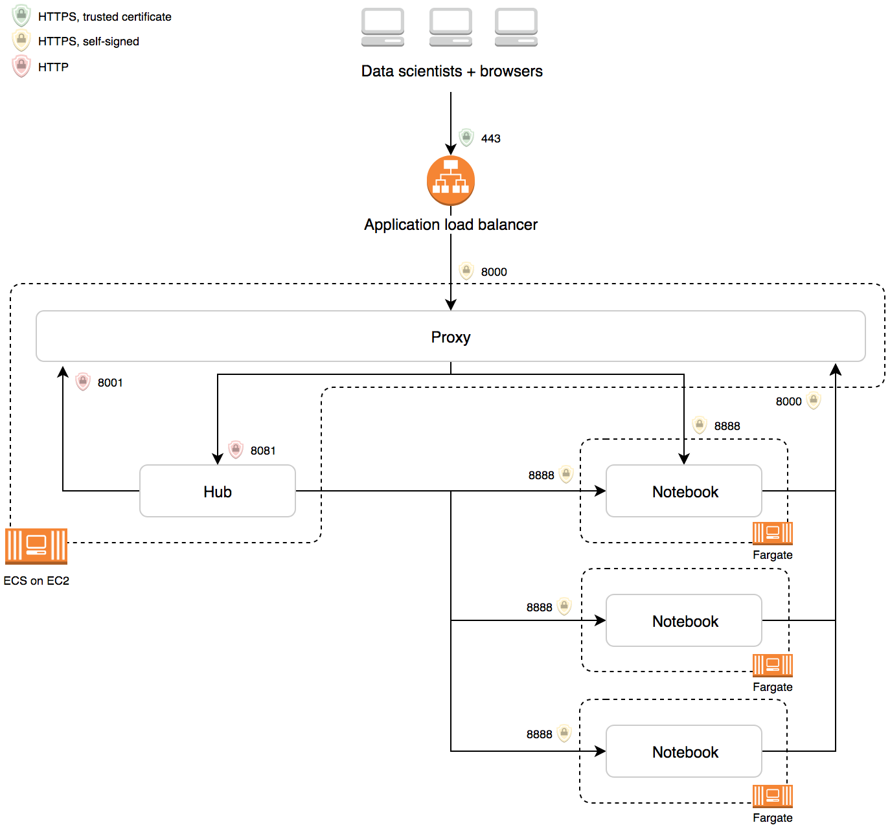

# jupyterhub-docker



# Building & Pushing Docker Images to Quay

## JupyterHub

```bash
docker build -t jupyterhub . && \
docker tag jupyterhub:latest  quay.io/uktrade/jupyterhub:latest && \
docker push quay.io/uktrade/jupyterhub:latest
```

## Single user notebook server

```bash
docker build -t jupyterhub-singleuser -f Dockerfile-singleuser . && \
docker tag jupyterhub-singleuser:latest  quay.io/uktrade/jupyterhub-singleuser:latest && \
docker push quay.io/uktrade/jupyterhub-singleuser:latest
```

```bash
docker build -t data-workspace-rstudio -f Dockerfile-rstudio . && \
docker tag data-workspace-rstudio:latest  quay.io/uktrade/data-workspace-rstudio:latest && \
docker push quay.io/uktrade/data-workspace-rstudio:latest
```

## Docker pull-through cache

To limit egress from the notebook servers, we only allow in-VPC connections. For the docker images themselves, we run a registry that proxies read access to certain images in Quay.

```bash
docker build -t jupyterhub-registry -f Dockerfile-registry . && \
docker tag jupyterhub-registry:latest  quay.io/uktrade/jupyterhub-registry:latest && \
docker push quay.io/uktrade/jupyterhub-registry:latest
```

## DNS Server

docker build -t jupyterhub-dnsmasq -f Dockerfile-dnsmasq . && \
docker tag jupyterhub-dnsmasq:latest  quay.io/uktrade/jupyterhub-dnsmasq:latest && \
docker push quay.io/uktrade/jupyterhub-dnsmasq:latest


## Sentry (Reverse) Proxy

docker build -t jupyterhub-sentryproxy -f Dockerfile-sentryproxy . && \
docker tag jupyterhub-sentryproxy:latest  quay.io/uktrade/jupyterhub-sentryproxy:latest && \
docker push quay.io/uktrade/jupyterhub-sentryproxy:latest


## Logstash

For logs from the notebook servers, we run a logstash instance inside the VPC that proxies to our public logstash service.

```bash
docker build -t jupyterhub-logstash -f Dockerfile-logstash . && \
docker tag jupyterhub-logstash:latest  quay.io/uktrade/jupyterhub-logstash:latest && \
docker push quay.io/uktrade/jupyterhub-logstash:latest
```
